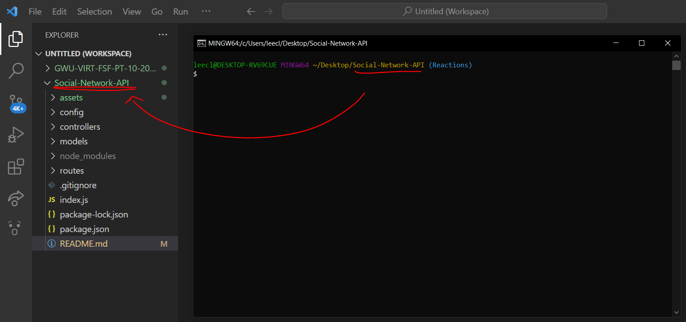

# Social Network API

## Description

This project is a a social network web application that uses a NoSQL database, MongoDB, allowing for scalability of data as would be needed for future expansion of social network features. This concept demonstrates the flexibility of a NoSQL database. This application allows for users to be seen, created, updated, and deleted via CRUD (Create, Read, Update and Delete) operations. Users can see, create, update, and delete thoughts. They can also add other users as friends or remove friends from their friend list. In addition, reactions to thoughts can be made, or deleted.

This project used npm packages [Mongoose version 6.9.2](https://www.npmjs.com/package/mongoose) to use object data modeling for structuring data and [Express version 4.18.2](https://www.npmjs.com/package/express) for Application Programming Interface (API) routing, allowing for CRUD operations to be performed on the data.

This project was also made with [Insomnia version 2022.7.5](https://insomnia.rest/), to test the Express APIs that manipulate data, and [MongoDBCompass version 1.35.0](https://www.mongodb.com/try/download/compass) which is a graphic user interface (GUI) for MongoDB databases, used to visualize and confirm the changes from the API routes. 

## Table of Contents
- [Installation](#installation-for-further-development-only)
    - [Git/GitBash](#gitgitbash---strongly-recommended)
    - [Visual Studio Code](#visual-studio-code-vsc---strongly-recommended)
    - [Node (REQUIRED)](#node-version-16---required-to-download-node-based-dependencies-ie-mongoose-and-express)
    - [Mongoose (REQUIRED)](#mongoose-version-692---required-to-structure-data-into-object-based-models)
    - [express (REQUIRED)](#express-version-4182---required-for-connecting-and-creating-routes-to-database-to-test-queriescrud-operations)
    - [Insomnia (REQUIRED)](#insomnia-version-202275---recommended-as-a-develop-tool-for-testing-connections-and-express-based-routes-to-database)
    - [MongoDB and MongoDB Compass (REQUIRED)](#mongodb-and-mongocompass-version-1350---required-to-host-database-mongodb-and-recommended-use-as-a-develop-tool-for-visualizing-database-while-testing-queries-mongodb-compass)
- [Usage](#usage)
- [Credits](#credits)
- [Questions](#questions)

## Installation (for further development only)

Make sure the following are downloaded:

### `Git/GitBash` - *Strongly Recommended*
* While this application can be run using with the default **command prompt**, it is easier to clone this repository by using Git/GitBash, which can be downloaded [here](https://git-scm.com/downloads).

### `Visual Studio Code [VSC]` - *Strongly Recommended*

* If you'd like to make changes to these files, Visual Studio Code is recommended and can be downloaded for free [here](https://code.visualstudio.com/download).

### `Node version 16` - **REQUIRED** to download node-based dependencies (i.e. Mongoose and express)
* Go to [Node's homepage, https://nodejs.org/en/](https://nodejs.org/en/), then [Downloads](https://nodejs.org/en/download/) and scroll down to the [Previous Releases](https://nodejs.org/en/download/releases/) bullet point. 

* Toggle between the results until the desired version 16 package and click Download. This application was developed with [Node.js version 16.18.0](https://nodejs.org/dist/v16.18.0/), click on [node-v16.18.0-x64.msi](https://nodejs.org/download/release/v16.18.0/node-v16.18.0-x64.msi) to download.

* The Full-Stack Blog also has [instructions on how to download Node](https://coding-boot-camp.github.io/full-stack/nodejs/how-to-install-nodejs).

### `Mongoose version 6.9.2` - **REQUIRED** to structure data into object-based models

* This **MUST** be installed into this repository, start by opening the command line interface.

* If you have Visual Code Studio, add this repository to the workspace. Then, go to 'Settings' either through the cog icon in the lower left corner and clicking Settings, go to File -> Preferences -> Settings in the menu bar, or the key combo of Ctrl+,

Method 1 - Cog:

Method 2 - File > Preferences > Setting:

* Then, change the settings in "Terminal: Explorer Kind" to "external" in the drop down menu.

        
* Change the filepath of the "Terminal > External: [respective operating system]" settings to the preferred command line interface program (either your system's Command Prompts's file path or Git/Git Bash's file path)

* After that, right-click the repository and select "Open in External Terminal"

* If you do not have VSC, open the preferred terminal.

* Use "cd Desktop" to first reach the Desktop, cd stands for change directory.

* Continue using "cd" to navigate through the file path to reach the location of this repository on your computer.

* Once this repository has been reached, type in `npm i mongoose@6.9.2` into the terminal and hit `Enter`.

### `express version 4.18.2` - **REQUIRED** for connecting and creating routes to database to test queries/CRUD operations

* Follow the same methods from the [Mongoose Installation Section](#mongoose-version-692---required-to-structure-data-into-object-based-models) to reach this repository if you've already exited out of the command-line, then type in `npm i express` and hit `Enter`.

### `Insomnia version 2022.7.5` - *Recommended* as a develop tool for testing connections and express-based routes to database

* Go to [Insomnia's homepage, https://insomnia.rest/](https://insomnia.rest/), then [Pricing](https://insomnia.rest/pricing) and click on the [Download Now](https://insomnia.rest/download)  button from the free tier.

* You **do not** need an account to use this application.

* Another popular alternative is Postman.

### `MongoDB AND MongoCompass version 1.35.0]` - *REQUIRED* to host database (MongoDB) and *recommended* use as a develop tool for visualizing database while testing queries (MongoDB Compass)

* Follow the Full-Stack Blog's [MongoDB and MongoDB Compass Installation Guide](https://coding-boot-camp.github.io/full-stack/mongodb/how-to-install-mongodb) to download **both** the MongoDB Server and MongoDB Compass for development purposes.

## Usage 

* A video of this application's usage can be viewed [here](#blank). If the link is non-functional, a copy of the video can be found in the "assets" folder.

* To start further developments to this application, start by using either of the two methods described in the [Mongoose Installation Section](#mongoose-version-692---required-to-structure-data-into-object-based-models) to reach this repository through the preferred terminal.

* Once this repository has been reached, type in `node index.js` or `node index` into the terminal and hit `Enter`. This will start the server and allow for querying. To close the server, use the key combination of `Ctrl+C`.

## Credits

* Schema custom and built-in validators information provided by [Mongoose](https://mongoosejs.com/):  https://mongoosejs.com/docs/validation.html

* Schema trim information provided by [Mongoose](https://mongoosejs.com/):  https://mongoosejs.com/docs/schematypes.html

* Getters information provided by [Mongoose](https://mongoosejs.com/):  https://mongoosejs.com/docs/tutorials/getters-setters.html

## Questions

If you have any questions, my GitHub profile is www.github.com/leeclaire156, and my email is lee.claire156@gmail.com.